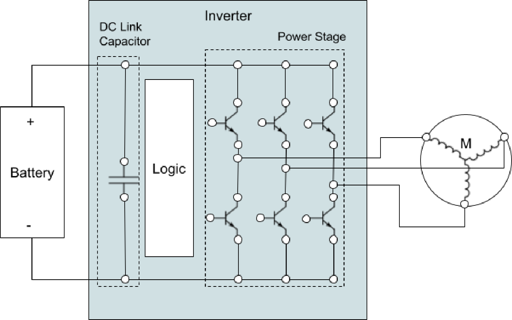
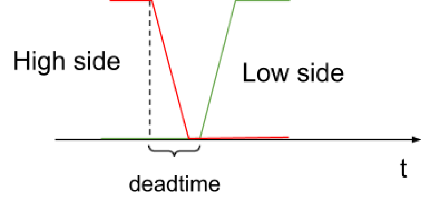
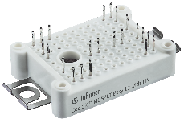
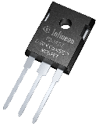
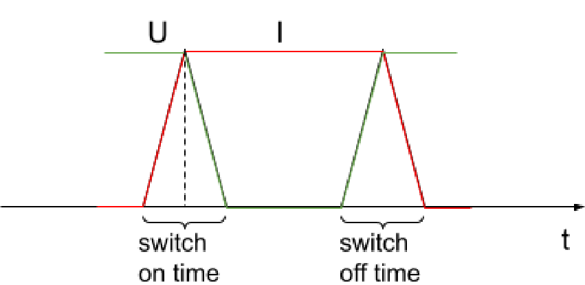
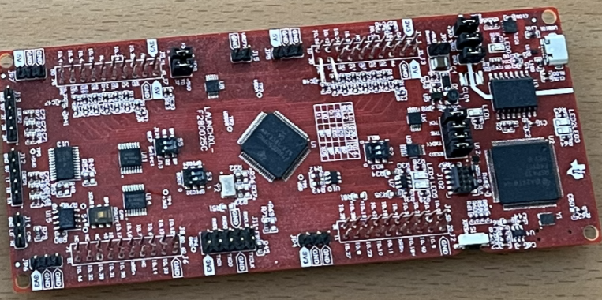
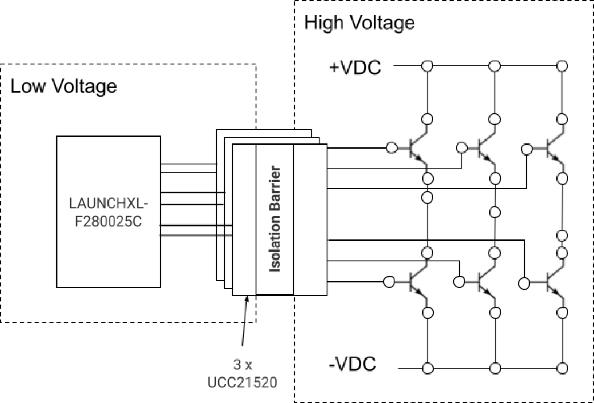
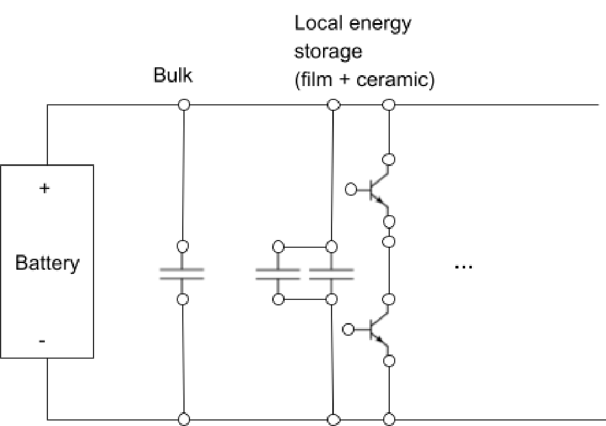
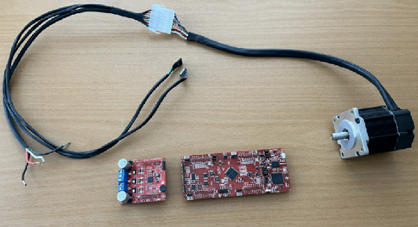

## Specification

- DC Input Voltage: 120 - 175 V
- Max RMS Phase Current: 150 A
- Max Output Power: 28 kW

## Introduction

The main purpose of the inverter is to convert a DC current into a three phase sinusoidal current feeding the motor.

The battery is made up of 48 LFP cells in series and therefore nominally delivers 154 volts and 175 volts fully charged. The inverter needs to be able to deliver about 20-28kW which translates to around 150A RMS of phase current. To have some margins it will be dimensioned for 200A and 200 V. The inverter can be divided into a capacitor stage, a control stage and a power stage. The control or logic will be handled by a Texas Instruments *F280025C LaunchPad*, reusing as much as possible of the *Universal Motor Control Lab project*. What needs to be designed and implemented is the capacitor and power stages of the inverter.

## System architecture

## Power Calculations

The active power of a 3-phase motor is calculated by

$$P = \sqrt{3} \times U_{LL(RMS)} \times I_L \times \cos\varphi$$

- ULL is the line-to-line voltage
- cosφ is the power factor, where φ is the phase angle between the voltage and current. The power factor should ideally be 1.
- IL is the phase current

There are two main operation modes for a PMSM - MTPA and field weakening. In the MTPA - Maximum Torque Per Ampere region, the power factor is close to 1 and the motor is operating at maximum efficiency. The field weakening region is entered in order to decrease back-EMF and enable higher RPMs. In this region the power factor is intentionally lowered to less than 1.

With SVPWM, the maximum achievable line-to-line RMS voltage is approximately 0.707 × VDC. Given a nominal DC voltage of 154 V, the line-to-line RMS voltage is then

$$U = 0.707 \times V_{DC} = 0.707 \times 154 = 109 \text{ V}$$

The active power in the MTPA region is then

$$P = \sqrt{3} \times U_{LL(RMS)} \times I_L \times \cos\varphi = \sqrt{3} \times 109 \times 150 = 28 \text{ kW}$$

## DC-Link Capacitor

This equation describes the current through a capacitor as a function of time

$$i(t) = C\frac{dv}{dt}$$

If we first simplify this equation to a time averaged version

$$I = C\frac{\Delta V}{\Delta t}$$

and then rearrange the terms, we end up with this equation we can use for estimating the capacitance required from a DC link capacitor:

$$C = \frac{I \times \Delta t}{\Delta V}$$

The DC-link capacitors are divided up into two steps bulk and HF, solving different problems.

### Bulk stage

The purpose of the bulk stage is to compensate for a source that is not ideal, a source that can not at all times deliver current at the pace required. The source from the inverters perspective is made up of the battery and the cables connecting the battery. Both the battery and the cables has a built in inductance resisting fast changes. This stage handles fluctuations during the longest time scale which requires relatively largest capacitance.

#### Capacitance calculations

Assume the following numbers:

- A current of 100 A
- An accepted voltage ripple ΔV of 10 % or 17.5 volt of the 175 V max
- Assume a source response time, Δt of 0.2ms

$$C = \frac{I \times \Delta t}{\Delta V} = \frac{100 \times 0.2 \cdot 10^{-3}}{17.5} \approx 1100 \,\mu\text{F}$$

Since the voltage source and cables inductance is unknown the assumption of 0.2ms is just a first guess that needs to be verified in the lab. For the final inverter, this simple charge-balance method becomes very sensitive to the assumed current and source response time. Using full phase current and hundreds of microseconds gives unrealistically large capacitance values, so final bulk sizing should instead be based on measured DC-link ripple, cable inductance, ripple-current rating and acceptable voltage droop.

:::note
The chosen current (100 A) and response time (0.2 ms) are rough estimates. In reality, these depend on:

- Battery internal resistance
- Cable inductance
- System layout
:::

### HF stage

This stage takes care of oscillations originating from the inverter itself and they are of a much higher frequency. The impedance of a capacitor is described by:

$$Z = ESR + j\left(\omega L - \frac{1}{\omega C}\right)$$

where L is the parasitic inductance of a capacitor.
As can be seen, the impedance caused by the inductance increases with frequency but since the purpose of this stage is to handle high frequencies we need a capacitor with a low parasitic inductance. Long story short, smaller capacitors have a smaller parasitic inductance so that's what is needed here.
The connections from capacitor to switches are adding to the parasitic inductance. So it's important that these capacitors are placed very close to the bridge, something that can be hard to achieve with large bulk capacitors.

If a full bridge IGBT module would be used instead, the design would allow for a direct connection between bulk capacitors and module and thereby reduce the need for a separate HF-stage.

To calculate how large the HF-capacitor has to be, let's assume the following numbers:

- 100 A
- ΔV = 17.5 V
- Δt = 0.2µs - commutation event time

During a commutation event there is a short amount of time where neither the upper nor the lower side is conducting but the motor inductance keeps the current flowing and during this interval the current needs to be sourced or sunk locally by the DC-link capacitors, since the source isn't fast enough to respond.

$$C = \frac{I \times \Delta t}{\Delta V} = \frac{100 \times 0.2 \cdot 10^{-6}}{17.5} = 1.14 \,\mu\text{F}$$

### RC-snubber

This is not a part of the DC-link capacitors but it helps damp ringing and absorb energy stored in parasitic inductances and are therefore mentioned in the same section as the other stages.

### Summary

| Stage | Problem solved | Time scale |
|---|---|---|
| Bulk | Voltage droop due to mainly source inductance | ms |
| HF | Ripples caused by the operation of the switching devices | ns–µs |
| RC-snubber | Dampens ringing and EMI | ns |

[https://eepower.com/technical-articles/simplified-calculation-of-dc-link-capacitors-for-automotive-high-performance-xev-power-train-architecture](https://eepower.com/technical-articles/simplified-calculation-of-dc-link-capacitors-for-automotive-high-performance-xev-power-train-architecture/)

## Power Stage

The power stage consists of 6 switching devices or three half bridges, where one half bridge consists of an upper and a lower switch. If these six switches are appropriately controlled, three sinusoidal phase currents are produced, driving the motor.

### Design Assumptions

- Switching frequency: 20 kHz
- Target switching time: <200 ns
- Estimated gate current: 4 A
- Initial current level for calculations: 100 A

:::note
These are design targets, not verified values.
:::

### Gate Driver

Between the MCU and the gates of the MOSFETS a gate driver component forms the interface between the logic stage and the power stage providing galvanic isolation and other features required to drive both the high- and low-side switches of half-bridges.

#### Drive Current

One important property of a gate driver is the current driving capability. The two main choices we have to pick between here are half-bridge drivers and single-channel drivers. A half-bridge driver handles both the high side and low side switches, requiring 3 in total for an inverter. A single-channel driver on the other hand drives only a single switch which means 6 drivers are required for the whole inverter. The tradeoff is that a half-bridge driver gives a more compact solution with fewer components while a single-channel driver can drive a much higher gate current.

#### Deadtime

Another important feature of a gate driver is it's ability to prevent *shoot-through* which is happening when both the high side and the low side switch are conducting at the same time. If this occurs it means that the current through the transistors are only limited by the capability of the source and the risk of damaging them is high and so needs to be prevented. A half bridge driver, as opted for in this design, solves this by enforcing a deadtime. A deadtime is the time between one switch turning off and the complementary switch turning on.

#### Component Selection

A Texas Instruments UCC21520 half bridge driver is selected in this design, in order to keep the design a bit more compact than if a single channel (e.g. TI UCC5871) would have been selected.

### Transistors

#### Technology

The most important component in the power stage is the transistor. First decision to make is whether to go with IGBTs or MOSFETs. IGBTs have a fixed voltage drop ($V_{CE\_sat}$) over the collector-emitter while the MOSFET behaves more like a resistor ($R_{DS(ON)}$) of the drain-source.
A low $V_{CE\_sat}$ value for an IGBT is 1.35V, so a current of 100A would give a power loss of $U \times I = 1.35 \times 100 = 135 \text{W}$. A low $R_{DS(ON)}$ would be 6mΩ, so 100A would mean a power loss of $I^2 \times R = 100^2 \times 0.006 = 60 \text{W}$, that is less than half. This loss in a MOSFET can be pushed down even lower by parallelling transistors. This rough comparison clearly speaks to the favour of MOSFET for this application, to limit the loss and the heat dissipation.

:::note
IGBTs may be preferable at higher voltages (>400 V) and lower switching frequencies.
:::

#### Package/Case

Transistors come in a lot of different cases modules or discretes.

MOSFET modules can enable a lower inductance current path as well as a more compact package which simplifies the mechanical construction. They might also simplify the cooling design. The downside is that a failure during development, resulting in a failed component, can be costly, therefore discretes will be used for at least the first inverter version. Discretes come in many different packages, many of which are surface mounted. Again to facilitate experimentation, a through hole package will be used, perhaps a TO247, which is a little larger than the TO220 and with better power dissipation.

#### Transistor parameters

Some important parameters are

- VDS - the maximum voltage the transistor can handle - 200 volt in this case
- IDS - the maximum current it can handle
- RDS(on) - resistance when in conducting state. This parameter is the resistance of the transistor in conducting state and is important since it directly adds to heat losses. This resistance also increases with temperature.
- Qg - total gate charge, should be as small as possible in a high frequency switching application

A tradeoff needs to be made, since a low RDS in general means a higher Qg which makes the transistor harder to drive, putting a higher demand on the gate driver.

#### Losses

The losses are not only but mainly made up of conduction losses and switching losses.

##### Conduction losses

Conduction losses stems from the on-state resistance in the transistors and the per switch loss is given by

$$P_{cond} = 3 \times I_{rms\,phase}^2 \times \frac{R_{DS(on)}}{N}$$

where N is the number of transistors in parallel

##### Switching losses

Switching losses are taking place during opening and closing of the switch. There is a time during opening and closing where current is flowing at the same time as there is a voltage drop between the drain and source. This current and voltage directly translates to power via $P = I \times U$. The size of this loss can be thought of as the area of the triangles and it can be approximated by

$$P_{sw} = 6 \times \frac{1}{2} \times V_{DC} \times I \times (t_r + t_f) \times f_{sw}$$

where the tr (rise time) and tf (fall time) can be roughly estimated by

$$t = \frac{Q_g}{I_g}$$

where Qg is the gate charge.
The key takeaway here is that a high Qg results in slower switching but you can mitigate that by increasing the gate current but that puts more demand on your gate driver circuit.

:::note
Switching times are approximated using gate charge, but real switching behavior is dominated by the Miller plateau and parasitic inductances. Therefore, calculated switching losses should be considered optimistic.

Real switching losses include:

- Turn-on and turn-off overlap losses
- Reverse recovery losses from the body diode (not included in calculations)
- Parasitic inductance effects (voltage overshoot) (not included in calculations)
:::

If transistors are connected in parallel to lower the Rds, the gate charge adds up.
The way to decrease the loss is to lower the size of this area by decreasing the rise and fall times or by decreasing the switching frequency.

### Component Selection

One candidate could be IXFH170N25X3 with the following specs:

- VDS = 250 Volt - some margin to 200 V
- IDS = 170 A - enough, especially if we put more than one transistor in parallel
- RDS(on) = 6.1 mΩ
- Qg = 190 nC

| Transistor | VDS (V) | IDS (A) | RDS(on) (mΩ) | QG (nC) |
|---|---|---|---|---|
| IXFH170N25X3 | 250 | 170 | 6.1 | 190 |
| IPP069N20NM6 | 200 | 136 | 6.9 | 73 |

Let's calculate the inverter loss at 100 A and 20kHz

#### Conduction Loss

$$P = 3 \times 100^2 \times 6.1 \times 10^{-3} = 183 \text{ W}$$

Since 3 transistors are always conducting, the total is 183 W. This number can be lowered by parallelling the transistors. Three mosfets in parallel would bring this number down to a total of 61 W for the whole inverter.

#### Switching Loss

The rise / fall time estimation:

$$t = \frac{Q_g}{I_g} = \frac{190 \times 10^{-9}}{4} = 47.5 \text{ ns}$$

where 4 A is the maximum driving current from the selected gate driver.

Let's be conservative and assume 200ns total rise and fall time the switching loss is then calculated as:

$$P = 6 \times \frac{1}{2} \times V \times I \times (t_r + t_f) \times f_{sw} = 6 \times \frac{1}{2} \times 154 \times 100 \times 200 \cdot 10^{-9} \times 20 \times 10^{3} = 185 \text{W}$$

Let's compare it with another transistor:

| Transistor | Pcond (W) | Psw (W) | Ptot (W) |
|---|---|---|---|
| IXFH170N25X3 | 183 | 185 | 368 |
| IPP069N20NM6 | 207 | 185 | 392 |

#### Parallel Transistors

To lower the conduction losses transistors can be put in parallel. A basic three phase bridge consists of 6 transistors. Mounting e.g. three transistors in parallel for each switch position would result in reduction of the conduction losses to a third or probably more. Since the resistance goes up with temperature a lowered resistance and loss would result in a lower temperature.

:::note
Parallelling reduces conduction losses but introduces that the risk/challenge that current might be shared unevenly between the transistors in parallel.
:::

| Transistor | Ptot (W) with 1 in parallel | Ptot (W) with 2 in parallel |
|---|---|---|
| IXFH170N25X3 (1) | 368 | 277 |
| IPP069N20NM6 (2) | 392 | 289 |

Since IXFH170N25X3 has a significantly larger gate charge, parallelling devices quickly increases the required gate charge and makes it harder for UCC21520 to maintain short switching times. IPP069N20NM6 therefore looks like a better match for this gate driver, even though its conduction losses are slightly higher.

## Logic Stage

The logic will be executed on a Texas Instruments *F280025C LaunchPad* development kit. This board features a C2000 family real time MCU with the periphery needed to control an inverter, e.g. PWM channels for controlling the MOSFETS.

### Control Logic

The control algorithm used is FOC - Field Oriented Control.

## PCB

### PCB Layout

There is a lot to take into consideration when designing the PCB for the inverter. These are some of the things.

#### Minimize Switch loop

When the high-side turns off and the low-side turns on, the voltage across the motor winding changes polarity almost instantaneously. This new voltage drives the phase current towards a lower value and eventually towards the opposite direction. However, due to the large inductance of the motor winding, the current cannot change instantaneously and continues to flow in approximately the same direction during the switching transition.

The energy required to maintain this current flow during the transition is supplied by the DC-link capacitors. To avoid forcing these high-frequency current pulses through the battery cables, the DC-link is divided into multiple stages. Each half-bridge has its own local HF stage, consisting of a film capacitor and a set of small ceramic capacitors placed directly across the half-bridge, between the drain of the high-side transistor and the source of the low-side transistor. These capacitors provide the shortest possible current path during switching and minimize the inductance of the switching loop.

Mental model: the battery supplies the average power while the dc-link capacitors supply the high-frequency switching energy.

#### Minimize gate loop

Minimize the gate loop by placing the gate driver and gate resistor close to the transistor. A small gate loop reduces parasitic inductance, improves switching behavior and reduces ringing.

#### Layers

The PCB will be made up of 4 layers, signals on the outer layers and VDC- and VDC+ (battery voltage) on the inner layers. Having VDC+/VDC- on separate layers helps when trying to design a tight switching loop. Closely spaced VDC+ and VDC− planes also reduce DC-link inductance.

## POC

Before designing the final board a POC is performed to verify a couple of things before spending too much money and effort. So the intent of POC will be to:

- verify that the board will work in the reference setup above, with this motor and the F280025C logic board.
- learn how to parameterize the software to work with a custom board
- find an affordable PCB prototype manufacturer and place an order
- Hopefully get some unavoidable lessons learned out of the way

In a Proof-Of-Concept both the VDC voltage and current will be very much smaller than in the real inverter.

- Max voltage: 20 volt
- Max current: 3A

Two things will be scaled down and simplified, the power switches can be lower rated and cheaper and more importantly the driver circuit can be simpler.
This POC design will rely on the TI reference design "TIDA-01540", which details the design of a 10kW inverter using the UCC21520 driver. This driver has a relatively low current driving rating - 4A peak source and 6A sink. A more efficient driver would be e.g. UCC5871 which can sink and source up to 30 A but this is also more complex, requiring a driver per switching device compared to the high side low side driving capability of the UCC21520.

TI's design is using a full bridge IGBT module that can handle 1200 volt and 75 A, so replacing this with lower rated discrete devices will be the most important changes.

### DC Link

#### Bulk Capacitance Calculations

Assume the following numbers:

- A current of 3A
- An accepted voltage ripple ΔV of 6.5 % or 1.3 volt, which puts it in the range of 5-10% of the 20 volt max
- Assume a source response time, Δt of 0.2ms

$$C = \frac{I \times \Delta t}{\Delta V} = \frac{3 \times 0.2 \cdot 10^{-3}}{1.3} = 462 \,\mu\text{F}$$

#### HF Capacitance Calculations

To calculate how large the HF-capacitor has to be, let's assume the following numbers:

- 3 A
- ΔV = 0.2 V
- Δt = 0.2µs - commutation event time

$$C = \frac{I \times \Delta t}{\Delta V} = \frac{3 \times 0.2 \cdot 10^{-6}}{0.2} = 3 \,\mu\text{F}$$

### Reference Setup

Here is a working reference setup consisting of a small motor a F280025C and a BOOSTXL-DRV8323RS power stage or drive stage as TI calls it.

The nice thing about this reference setup is that it should be possible to keep the control stage and motor pretty much unchanged, except for some parameterization in the software and test the new power stage.
