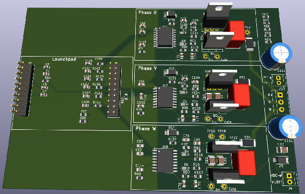
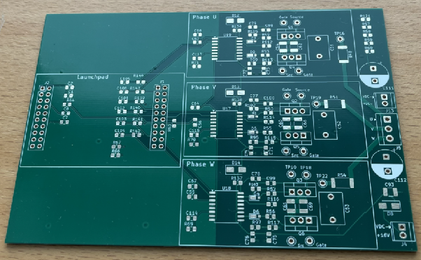
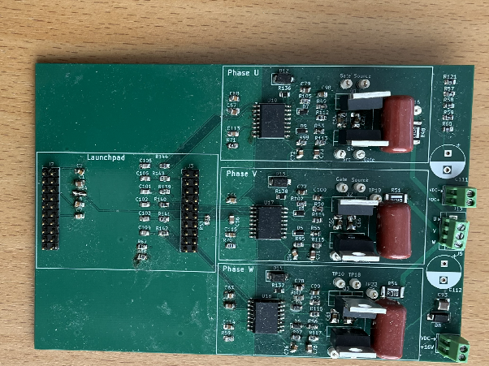
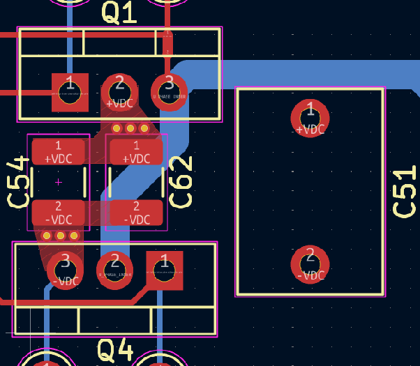

import YouTube from '../../../components/YouTube.astro';

Before designing the final board a POC is performed to verify a couple of things before spending too much money and effort. So the intent of POC will be to:

- verify that the board will work in the reference setup below, with this motor and the F280025C logic board.
- learn how to parameterize the software to work with a custom board
- find an affordable PCB prototype manufacturer and place an order
- Hopefully get some unavoidable lessons learned out of the way

In a Proof-Of-Concept both the VDC voltage and current will be very much smaller than in the real inverter.

- Max voltage: 20 volt
- Max current: 3A

Two things will be scaled down and simplified, the power switches can be lower rated and cheaper and more importantly the driver circuit can be simpler.
This POC design will rely on the TI reference design "TIDA-01540", which details the design of a 10kW inverter using the UCC21520 driver. This driver has a relatively low current driving rating - 4A peak source and 6A sink. A more efficient driver would be e.g. UCC5871 which can sink and source up to 30 A but this is also more complex, requiring a driver per switching device compared to the high side low side driving capability of the UCC21520.

TI's design is using a full bridge IGBT module that can handle 1200 volt and 75 A, so replacing this with lower rated discrete devices will be the most important changes.

## DC Link

### Bulk Capacitance Calculations

Assume the following numbers:

- A current of 3A
- An accepted voltage ripple ΔV of 6.5 % or 1.3 volt, which puts it in the range of 5-10% of the 20 volt max
- Assume a source response time, Δt of 0.2ms

$$C = \frac{I \times \Delta t}{\Delta V} = \frac{3 \times 0.2 \cdot 10^{-3}}{1.3} = 462 \,\mu\text{F}$$

### HF Capacitance Calculations

To calculate how large the HF-capacitor has to be, let's assume the following numbers:

- 3 A
- ΔV = 0.2 V
- Δt = 0.2µs - commutation event time

$$C = \frac{I \times \Delta t}{\Delta V} = \frac{3 \times 0.2 \cdot 10^{-6}}{0.2} = 3 \,\mu\text{F}$$

## Reference Setup

Here is a working reference setup consisting of a small motor, a F280025C, and a BOOSTXL-DRV8323RS power stage or drive stage as TI calls it.

The nice thing about this reference setup is that it should be possible to keep the control stage and motor pretty much unchanged, except for some parameterization in the software and test the new power stage.

## Custom power board

The power stage in the reference setup needs to be replaced with a custom board that can handle substantially more power - both higher voltage and current.

### V1

The objective of the first version is to verify the basics — that a custom 3-phase bridge, together with the F280025C, can make a motor spin. There are a lot of unknowns and things that can go wrong so to reduce the complexity the first version will just run in open-loop mode - no current measurements and no FOC algorithm will be employed. The board has been designed in KiCad and ordered from a Chinese manufacturer.

*3D view from KiCad*

*Board before assembly*

*Board after assembly*

The board also does not have paralleled transistors at this stage, since the current is very low.

*Half-bridge*

The above close up of a half-bridge is intended to give a view of a tight switch loop, with two stages of capacitors in the HF stage. C54 and C62 are two smaller ceramic capacitors directly between the source of the low-side and the drain of the high-side mosfet, C51 is a larger film capacitor.

Video of the motor first spinning with the V1 board:

<YouTube id="U24UtcwQST4" title="The motor first spinning with the V1 power board" />
